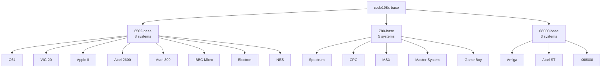
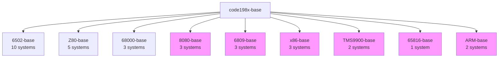

# 32 System Architecture - Full Scale Test

## Current State: 16 Systems, 3 CPU Families



## Proposed: 32 Systems, 9 CPU Families



## System Distribution by Era

| Era | Processor | Systems | Notable Examples |
|-----|-----------|---------|------------------|
| **1975-1977** | 8080 | 3 | Altair 8800, IMSAI 8080 |
| **1977-1980** | 6502 | 10 | Apple II, C64, Atari 2600 |
| **1980-1983** | Z80 | 5 | Spectrum, MSX, CPC |
| **1980-1982** | 6809 | 3 | TRS-80 CoCo, Dragon 32 |
| **1981-1984** | x86 | 3 | IBM PC, PC/AT |
| **1981** | TMS9900 | 2 | TI-99/4A |
| **1985-1987** | 68000 | 3 | Amiga, Atari ST |
| **1986** | 65816 | 1 | Apple IIGS |
| **1987-1994** | ARM | 2 | Archimedes, RISC PC |

## Parallelization Analysis

### With 16 Systems (Current)
```
Total Jobs: 20 (1 root + 3 CPU + 16 systems)
GitHub Free Tier: ✅ Just fits (20 job limit)
Build Time: ~15-20 minutes
```

### With 32 Systems (Proposed)
```
Total Jobs: 36 (1 root + 9 CPU + 26 systems)
GitHub Free Tier: ❌ Exceeds limit (20 jobs max)
Build Time: Would need waves or paid tier
```

## Solutions for 32+ Systems

### Option 1: Wave-Based Building
```yaml
jobs:
  # Wave 1: Critical systems (fits in 20 jobs)
  wave1:
    needs: [base-images]
    # Build 15 most important systems

  # Wave 2: Secondary systems
  wave2:
    needs: [wave1]
    # Build next 11 systems
```

### Option 2: Matrix Strategy with Batching
```yaml
strategy:
  max-parallel: 5  # Limit concurrent jobs
  matrix:
    batch: [1, 2, 3, 4, 5]
    # Each batch builds 5-6 systems
```

### Option 3: Processor Family Serialization
```yaml
# Build processor families sequentially
# But systems within each family in parallel
6502-family -> z80-family -> 68000-family -> ...
```

## Workflow Comparison

| Approach | Pros | Cons |
|----------|------|------|
| **Full Parallel** | Fastest (15-20 min) | Exceeds free tier |
| **Waves** | Fits free tier | Slower (30-40 min) |
| **Matrix Batching** | Controlled concurrency | Complex configuration |
| **Family Serial** | Simple, predictable | Slowest (45+ min) |

## Recommended Approach

1. **For Testing**: Use manual dispatch with system selection
2. **For CI**: Implement smart waves based on:
   - Most frequently updated systems (Wave 1)
   - Popular systems (Wave 2)
   - Exotic/rare systems (Wave 3)
3. **For Production**: Consider GitHub paid tier for full parallelization

## Adding More Processor Families

Each new CPU family requires:

1. **Base Image** (~50-100 lines)
   ```dockerfile
   FROM code198x-base
   # Install/build assembler
   # Configure environment
   ```

2. **Workflow Job** (~15 lines)
   ```yaml
   build-8080-base:
     needs: build-root-base
     # Build configuration
   ```

3. **System Jobs** (~10 lines each)
   ```yaml
   build-altair-8800:
     needs: build-8080-base
     uses: ./.github/workflows/build-system-image.yml
   ```

## Assembler Availability

| Processor | Assembler | Source | Status |
|-----------|-----------|---------|---------|
| 8080 | asm8080 | GitHub | ✅ Available |
| 6809 | lwasm | lwtools.ca | ✅ Available |
| x86 | NASM | nasm.us | ✅ Available |
| TMS9900 | xas99 | GitHub | ✅ Available |
| 65816 | ca65 | cc65 suite | ✅ In 6502-base |
| ARM | gas-arm | GNU | ✅ Available |

## Impact on CI/CD

With proper caching and parallelization:
- **16 systems**: 15-20 minutes ✅
- **32 systems**: 20-25 minutes (with waves)
- **64 systems**: 30-40 minutes (with smart batching)

## Conclusion

Adding 16 more systems with 6 new processor families is **technically feasible** but requires:
1. Workflow restructuring for GitHub Actions limits
2. ~6 new base images with assemblers
3. Smart batching or wave strategy
4. Potentially upgrading to GitHub paid tier

The modular architecture handles this well - each new system is just:
- 1 Dockerfile (20 lines)
- 1 workflow job call (10 lines)
- No changes to existing systems