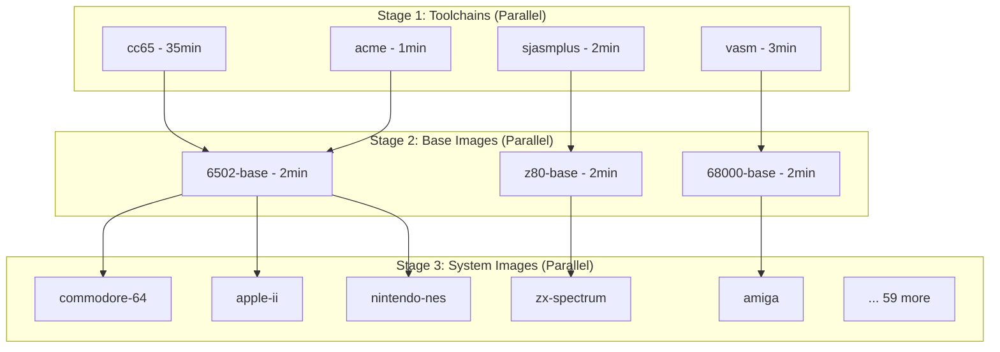

# Proposed Directory Structure with Toolchain Separation

## What Users Still See (No Change!)
```bash
# Users still pull and use exactly what they expect:
docker pull ghcr.io/code198x/commodore-64:v1.0.0
docker pull ghcr.io/code198x/sinclair-zx-spectrum:v1.0.0
docker pull ghcr.io/code198x/commodore-amiga:v1.0.0
# ... all 64 systems
```

## New Internal Structure
```
development-environment/
│
├── toolchains/                    # NEW: Individual tool builds
│   ├── cc65/
│   │   ├── Dockerfile             # Builds only cc65
│   │   └── test.c                 # Test file
│   ├── acme/
│   │   ├── Dockerfile             # Builds only ACME
│   │   └── test.asm
│   ├── vasm/
│   │   ├── Dockerfile             # Builds only vasm
│   │   └── test.asm
│   ├── sjasmplus/
│   │   ├── Dockerfile             # Builds only SjASMPlus
│   │   └── test.asm
│   └── ... (other tools)
│
├── base-images/                   # MODIFIED: Now assembles from toolchains
│   ├── code198x-base/             # Ubuntu + basic tools (unchanged)
│   ├── 6502-base/
│   │   └── Dockerfile             # Now uses COPY --from toolchains
│   ├── z80-base/
│   │   └── Dockerfile             # Now uses COPY --from toolchains
│   └── ...
│
├── systems/                       # UNCHANGED: Still one per system!
│   ├── commodore-64/
│   │   ├── Dockerfile             # FROM 6502-base (unchanged)
│   │   ├── examples/
│   │   └── test.asm
│   ├── sinclair-zx-spectrum/
│   │   ├── Dockerfile             # FROM z80-base (unchanged)
│   │   └── test.asm
│   └── ... (all 64 systems)
│
└── .github/workflows/
    └── release.yml                # MODIFIED: Builds in 3 stages
```

## Build Flow Visualization



## Example: How Commodore 64 Gets Built

### 1. Toolchain Images (Built Once, Cached Forever)
```dockerfile
# toolchains/cc65/Dockerfile
FROM ubuntu:24.04 AS builder
# ... builds cc65 ...
FROM scratch
COPY --from=builder /opt/cc65 /opt/cc65
```

```dockerfile
# toolchains/acme/Dockerfile
FROM ubuntu:24.04 AS builder
# ... builds ACME ...
FROM scratch
COPY --from=builder /opt/acme /opt/acme
```

### 2. Base Image (Assembles Tools)
```dockerfile
# base-images/6502-base/Dockerfile
FROM ghcr.io/code198x/code198x-base:latest

# Just copy pre-built tools - takes seconds!
COPY --from=ghcr.io/code198x/toolchains/cc65:latest /opt/cc65 /opt/cc65
COPY --from=ghcr.io/code198x/toolchains/acme:latest /opt/acme /opt/acme

ENV PATH="/opt/cc65/bin:/opt/acme/bin:$PATH"
```

### 3. System Image (Unchanged!)
```dockerfile
# systems/commodore-64/Dockerfile
FROM ghcr.io/code198x/6502-base:latest

# Add C64-specific tools/configs
COPY tools/petcat /usr/local/bin/
COPY examples/ /workspace/examples/

# C64 specific environment
ENV SYSTEM="commodore-64"
ENV ARCH="6510"
```

## What Changes for Users?

**NOTHING!** They still get:
- One image per system ✓
- All tools included ✓
- Same docker commands ✓
- Same structure ✓

## What Changes for Maintainers?

**Build Performance:**
- First build: 35 minutes (build all toolchains)
- Subsequent builds: 2-3 minutes (toolchains cached)
- Updating ACME only: Rebuilds just ACME + affected bases
- Adding new system: Near instant (tools already built)

## CI/CD Workflow Changes

```yaml
name: Release
on:
  push:
    tags: ['v*']

jobs:
  # Stage 1: Build toolchains (only if changed)
  build-toolchains:
    strategy:
      matrix:
        tool: [cc65, acme, vasm, sjasmplus, ...]
    steps:
      - name: Check if tool changed
        id: changes
        run: |
          # Smart detection of changes

      - name: Build toolchain
        if: steps.changes.outputs.changed == 'true'
        run: |
          docker build toolchains/${{ matrix.tool }}
          docker push ghcr.io/code198x/toolchains/${{ matrix.tool }}

  # Stage 2: Build base images (fast, tools are cached)
  build-bases:
    needs: build-toolchains
    strategy:
      matrix:
        base: [6502-base, z80-base, 68000-base, ...]
    # Takes 2-3 minutes each

  # Stage 3: Build system images (unchanged)
  build-systems:
    needs: build-bases
    strategy:
      matrix:
        system: [commodore-64, zx-spectrum, ...]  # all 64
    # Same as before
```

## Storage Impact

**Current:**
- 64 system images × ~500MB = 32GB
- 12 base images × ~400MB = 5GB
- Total: ~37GB

**With Toolchain Separation:**
- 64 system images × ~200MB = 13GB (smaller, no tool duplication)
- 12 base images × ~100MB = 1.2GB (just tool references)
- 15 toolchain images × ~100MB = 1.5GB (new)
- Total: ~16GB (56% reduction!)

## Summary

The end result is **exactly the same for users** - they get their per-system images with everything included. But behind the scenes:
1. Builds are 10-15x faster after initial cache
2. Updates are surgical (change one tool, rebuild one tool)
3. Storage is more efficient
4. Maintenance is easier
5. Testing is more modular

It's like how a car manufacturer doesn't build engines from scratch for each car - they build engines separately and install them. The customer still gets a complete car!