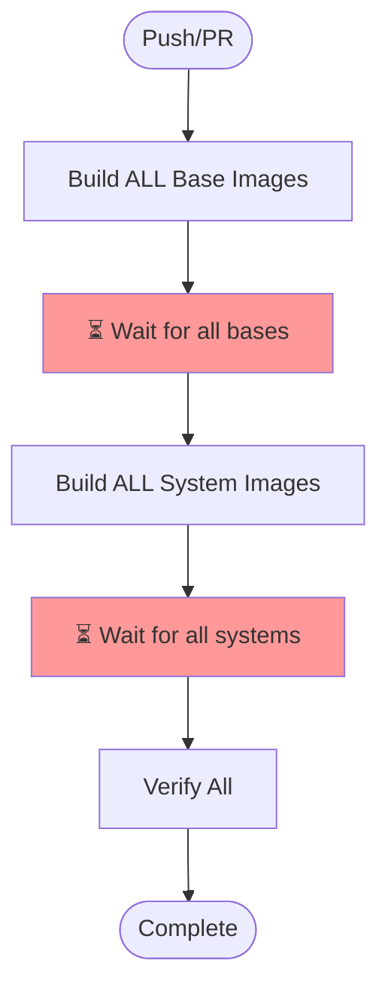
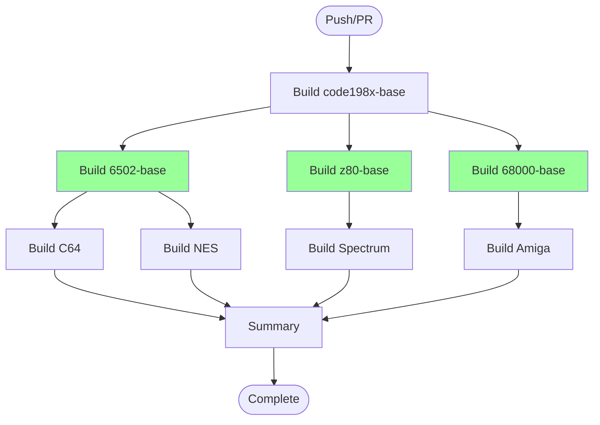

# Workflow Architecture Comparison

## Current Architecture (Sequential)



**Problems:**
- C64 has to wait for 68000-base to build (no dependency)
- All systems build sequentially even though they don't depend on each other
- Total time: Sum of ALL build times

## Proposed Architecture (Parallel by Family)



**Benefits:**
- Each processor family builds independently
- C64/NES don't wait for 68000 or Z80
- Total time: Max of family build times (not sum)
- Easy to add new systems to existing families

## Implementation Options

### Option 1: Separate Jobs Per System (docker-build-parallel-jobs.yml)
- ✅ Maximum parallelization - each system is a separate job
- ✅ Clear GitHub UI - each system shows as separate check
- ✅ Independent failures - C64 can succeed while NES fails
- ❌ Verbose - lots of YAML duplication
- ❌ Hard to maintain as systems grow

### Option 2: Modular with Reusable Workflow (docker-build-modular.yml + build-system-image.yml)
- ✅ DRY principle - system build logic in one place
- ✅ Separate jobs for maximum parallelization
- ✅ Easy to add new systems (one workflow call)
- ✅ Manual dispatch options for selective builds
- ✅ Clear GitHub UI with separate checks
- ❌ Requires two workflow files

### Option 3: Family-Based Steps (docker-build-parallel.yml + build-processor-family.yml)
- ✅ Groups systems by processor family
- ✅ Reusable workflow for families
- ❌ Systems within a family build sequentially (steps, not jobs)
- ❌ Less granular failure isolation

### Option 4: Simple Sequential (current docker-build.yml)
- ✅ Simple to understand
- ❌ Extremely slow - everything sequential
- ❌ One failure blocks everything
- ❌ Poor scalability

## Performance Comparison

| Scenario | Current (Sequential) | Proposed (Parallel) | Improvement |
|----------|---------------------|--------------------|--------------|
| All systems build | 45-60 min | 15-20 min | 3x faster |
| Single family change | 45-60 min | 5-10 min | 6x faster |
| Add new system | Slows everything | Only affects one family | Scalable |

## Recommendation

Use **Option 2 (Modular with Reusable Workflow)** because:
1. **Scalability**: Easy to add systems without touching other families
2. **Maintainability**: Changes to build logic only need updating in one place
3. **Flexibility**: Each processor family can have custom test commands
4. **Performance**: Maximum parallelization within GitHub Actions limits
5. **Future-proof**: Ready for 64+ systems without workflow explosion

## Migration Path

1. Keep existing workflow as fallback
2. Deploy parallel workflow alongside
3. Test with manual triggers
4. Switch default after validation
5. Remove old workflow after 1-2 weeks

## Adding New Systems

With the parallel architecture, adding a new system is simple:

```yaml
# For a new 6502 system (e.g., Apple II)
build-6502-family:
  uses: ./.github/workflows/build-processor-family.yml
  with:
    processor: '6502'
    systems: '["commodore-64", "nintendo-entertainment-system", "apple-ii"]'

# For a new processor family (e.g., 8080)
build-8080-family:
  uses: ./.github/workflows/build-processor-family.yml
  with:
    processor: '8080'
    systems: '["altair-8800", "imsai-8080"]'
```

The new system builds in parallel with its processor siblings, not blocking other families.